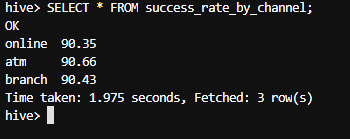

# Bank Transaction Monitoring and Fraud Detection Pipeline


---

## Problem Statement

In  the modern  digital  banking  ecosystem, millions of transactions occur daily through ATMs, online portals,  and  physical  branches.
These  transactions  need  to  be analyzed  for  operational  efficiency, compliance reporting, and fraud detection.
As part of the Data Engineering team at a leading bank,
your goal is to design and implement a robust ETL pipelinethat performs both:

- Batch Processing for historical transaction analysis and reporting.

- Real-time Stream Processingto identify potentially fraudulent transactions as they occur.

You  will  build  this  solution  using  a  Big  Data  stack  including 
HDFS,  Hive,  HBase,  PySpark,  SparkSQL (DataFrame API), Spark Streaming, and Kafka

*****************************************
## Task 1: Data Ingestion (Batch)

### Create a directory structure in HDFS for banking data.

- Created a directory within HDFS using `hdfs dfs` command option with `-mkdir -p` option to create the specified directory and it's parent directories.

### Upload the dataset (banking_transaction.csv) into HDFS

- Copied the `banking_transaction.csv` raw dataset into HDFS using `hdfs dfs` command using `-copyFromLocal` option.

### Output

  

---

## Task 2: Data Transformation with PySpark

### Load the HDFS data into a PySpark DataFrame

- Loaded data from the `banking_transaction.csv` into a dataframe for cleaning and transfomation operations.

 


### Normalize text fields (`transaction_type`, `channel`) to lowercase

- Normalize `transaction_type` and `channel` to lowercase character using the `lower` method.

 


### Filter out failed transactions.

- Filtered out the failed values from the raw dataset.

 


### Add derived columns: `txn_day`, `txn_hour`, `high_value_flag` (if amount > ₹500)

- Add 3 new column into the dataset
    - `txn_day`
    - `txn_hour`
    - `high_value_flag` _(if amount > ₹500)_

 

---

## Task 3: Hive-Based Reporting (Batch Analytics)

### Create Hive external or managed tables

- Created hive tables for dataframes created during previous task.

 

<br>

 

<br>

- Loaded the data into hive table dataframe via pyspark.

---

## Task 4: SparkSQL Analytical Queries

### Customer Behavior Insights

#### Top 5 customers by number of transactions

- Grouped all the records by `customer_id` attribute.
- Computed count of `transaction_id` attribute from the grouped records.
- Sort/Order by the computed count values in descending order.
- Limit the records by 5 to retrive top 5 customers
- Saved the result into a new hive table.

 


#### Customer with the highest total withdrawal amount

- Filtered on `transaction_type` where the values is `withdrawal` .
- Grouped based on `customer_id` and computed the total `amount`.
- Sort/Order by the computed sum values in descending order.
- Limit the records by 1 to retrive top customers with highest transaction amount 
- Saved the result into a new hive table.

 


#### Monthly transaction volume per customer

- Derived a new column called `txn_month` from `txn_timestamp`.
- Grouped based on `customer_id` and `txn_month`.
- Computed the number of transaction per group.
- Saved the result into a new hive table.

 


### Channel & Platform Analytics

#### Average transaction amount by channel

- Grouped based on `channel`.
- Computed the average transaction amount using `amount`.
- Saved the result into a new hive table.

 

#### Success rate of transactions by channel

- Derived a new column `success_flag` which is flagged as `1` or `0` based on `status` attribute.
- Grouped based on `customer_id` and `txn_month`.
- Computed the number of transaction within each group.
- Saved the result into a new hive table.

 


### Time-Based Analytics

#### Hourly transaction trend (peak hours)

- Grouped teh records based on `txn_hour`.
- Computed the number of `transaction_id` and total `amount` per each hour.
- Order based on `txn_hour` in descending order.
- Limit the output by 10 for Peak hours.
- Saved the result into a new hive table.

 


#### Day-wise total transaction volume and amount

- Grouped the records based on `txn_day` attribute.
- Computed the number of `transaction_id` and total `amount` per each day group.
- Order based on `txn_day` in descending order.
- Saved the result into a new hive table.

 


### Fraud Pattern Indicators

#### Number of high-value transactions (> ₹500) per customer per day

- Filter the records whose amount is greater than 500 INR.
- Group based on `customer_id`.
- Compute the count of `transaction_id`.
- Saved the result into a new hive table.

 


#### Customers with more than 3 failed transactions in a day

- Filter the dataset whose status has failed.
- Derived a new column `txn_day` from `txn_timestamp`
- Group based on `customer_id`.
- Compute the count of `transaction_id`.
- Order based on count of `transaction_id` in descending order.
- Filtered the resultant set whose no of failed transcation is greater than 3.
- Saved the result into a new hive table.

 


#### Customers who used all three channels (ATM, Online, Branch) in the last 7 days

- Group based on 7 days time window on `txn_timestamp` and `customer_id`
- Aggregated the values of  `channel` attribute into a set per each group
- Filtered the records whose `channel` set size is equal to the total number of distinct `channel` present in the given dataframe.
- Retriving the `customer_id` as per the problem statement.
- Saved the result into a new hive table.

 

---

## Task 5: Real-Time Fraud Detection Pipeline


- Created a kafka reading stream using `SparkSession`.
- Applied the schema to the streaming dataframe using the following schema

    ```sql
    transaction_id INT NOT NULL,
    customer_id INT,
    txn_timestamp TIMESTAMP NOT NULL,
    amount DOUBLE,
    transaction_type STRING,
    status STRING,
    txn_day INT NOT NULL,
    txn_hour INT NOT NULL,
    channel STRING
    ```

- Filtered the streaming dataframe with time-independent conditions as follows,
    - We only required `withdrawl` type of transactions.
    - The amount should be greater than 100 INR.
- We define a function that process batch dataframe as follows,
    - The input batch dataframe is grouped based on 1 minute time window and per customer and save it as a new dataframe
    - Joined the grouped dataframe and input batch dataframe to retrive the required attributes.
    - Added a default value for a new column called `reason` to joined dataframe.
    - Retrive the processed data from the joined dataframe and load them into Hbase throught Hbase connectivity via `happybase` module.
- Performed the write stream using the filted dataframe and using the above function to process the kafka's read stream for each batch.

### Output:

